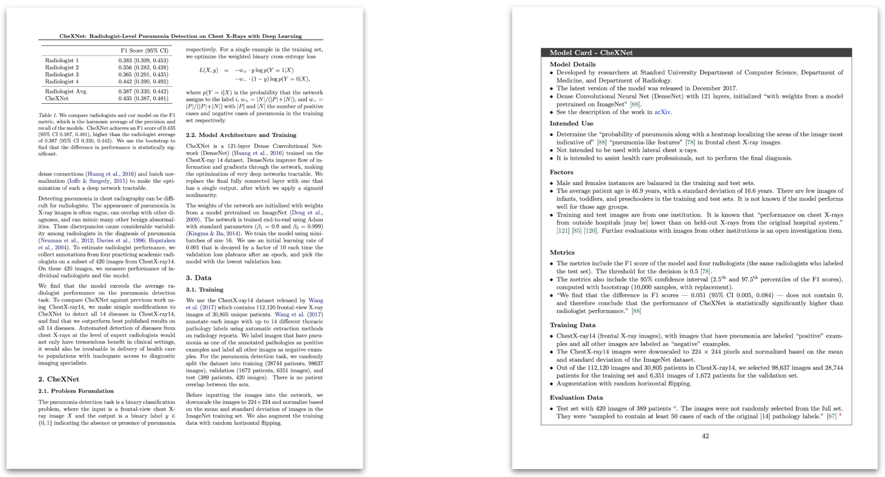
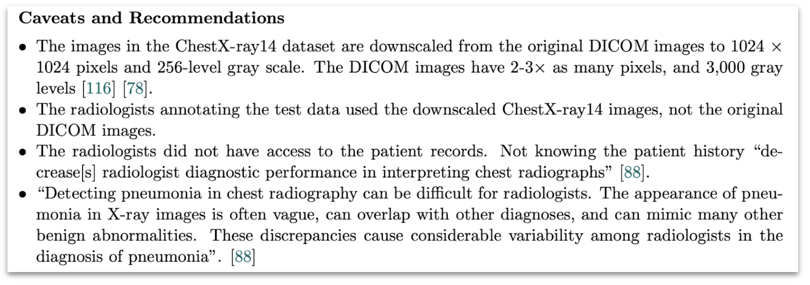

# CheXNet Model Card

A [model card](https://arxiv.org/abs/1810.03993) for the [CheXNet model](https://arxiv.org/abs/1711.05225).

See [the PDF generated from the LaTeX files here](./chexnet-model-card.pdf).

The model card is written from the first-person point of view, as if the authors had created it, to make it more realistic.

[Model cards](https://arxiv.org/abs/1810.03993) are "short documents accompanying trained machine learning models that provide benchmarked evaluation in a variety of conditions, such as across different cultural, demographic, or phenotypic groups \ldots and intersectional groups \ldots that are relevant to the intended application domains. Model cards also disclose the context in which models are intended to be used, details of the performance evaluation procedures, and other relevant information."

Model cards were motivated by systematic bias in commercial applications that were discovered only after the models were released. To counter that, the authors "advocate for measures of model performance that contain quantitative evaluation results to be broken down by individual cultural, demographic, or phenotypic groups, domain-relevant conditions, and intersectional analysis combining two (or more) groups and conditions." The emphasis on ethic aspects of the measurements is a distinguishing feature of model cards, compared to other proposals to document models.

See also [Google's page on model cards](https://modelcards.withgoogle.com/about).

On the left side we see the prose format of the paper. On the right side we see the structured format of the model card.

The "Caveats and Recommendations" section of the model card.

## Templates

This model card was created with the [Overleaf template](https://www.overleaf.com/latex/templates/model-card-template/fjmvzbbbxmwx). There is also a [Markdown template for model cards](https://github.com/fau-masters-collected-works-cgarbin/model-card-template).
